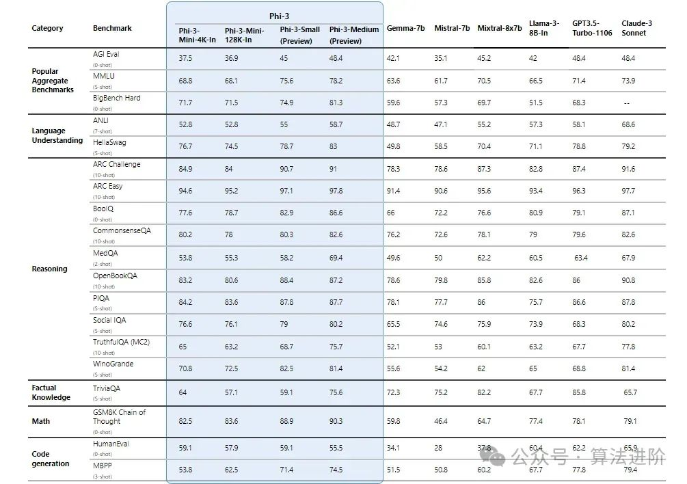

<!-- # Kaggle_20Q
kaggle 20Q noob team from three academic trashes -->
## 1. Task Description
使用LLMs来进行经典的20 Question游戏，即通过有限问答来猜测出一个对方预先选好的secret word。每次比赛以2v2的形式进行，每队各有两个LLMs，**一个guesser LLM负责根据对方answerer LLM的回答进行提问**，**另一个answerer LLM则负责理解对方队伍的提问并回答yes或者no**。

        
<b> Rules </b>

1. 游戏会被限制在20轮内，超过轮数双方判负
2. 提问限制在2000个字符内
3. 回答限制在100个字符内
4. answerer只能回答yes或者no
5. 任何违规行为直接判负

        
<b> 资源 </b>

100G disk，16G RAM，T4 GPU

#### 1.1. Summary
基本上来说，agent需要至少具备两个功能：1. 正确**理解问题**并更具secret word**回答**；2. 根据对方的回答来进行下一个猜测和提问。而根据猜测回答问题则需要agent具有足够的**信息搜集**和**推理能力**

---

## 2. Methodology
其实agent的任务本质上是减小下一步的熵（或者是确信度）：作为guesser时，可以是选择能最小化熵的提问方法/secrete word的特征点/etc；而作为answerer时的，这是在yes或者no当中二选一一个置信度最大的选项

而具体怎么实现可能有很多种方法，具体依照game env能提供的游戏信息（例如我们知不知道全部的key words词表）来确定
> 💬
> - 通过**prompting engineering**简单地来选取LLM自己认为置信度最高的特征，回答，猜测，...
> - 通过一些统计上的方法来衡量不确定性
> - 通过一些机器学习的方法来估计一个最大化（最小化）置信度，信息增益，...的选项
>

<!-- 

    
<b> Draft </b>
  -->

#### 2.1. KnowNo

那既然都提到了置信度的问题了，刚好可以考虑能不能使用之前面试读到那篇paper，通过一种简单有效的方法来让agent能够自己估计不确定性或者置信度

该文章本质是让robot在实际环境中能够确定有没有歧义的选项，但里面有用到一些比较好用的方法，例如使用多选问题（Multi Choice Question&Answer）来将LLM输出的token的置信度作为这个选项的置信度

至于其具体能否应用进去，可能需要更多的仔细考虑

<!-- 
 -->
---

## 3. To-do 📝
暂时来说，目前还在形成思路的阶段，但是有一些东西可以先去了解

- [ ] 怎么部署LLM

> - 这个似乎有很多不同的方法，例如Kaggle似乎原生支持一些合作商的LLM（这里主要是Gemma）的调用，如果我想在自己的环境下测试的话（或者colab环境），可能需要考虑别的方法
> - Kaggle也提供了一些别的LLM，例如Llama 3的各种库的模型实现，并且例如Llama 3，Kaggle也提供了Vertex AI（似乎是Google提供给用户部署LLM的云）的跳转链接。但具体怎么部署还需要自己探索
> - 别的一些开源模型比如Claude等，可以自己获取自己部署
> 
> *但请记住，我们只有16G，应该只能部署一些7B左右的LLM，而且可能需要考虑到会不会有别的小一点的辅助模型需要训练和部署*
- [ ] 思考一下agent的大致框架
- [ ] 看started notebook，对agent的实现有个大概的概念
- [ ] 看论文，或者去搜集别的思路（Chain of Thoughts）来看看能不能达成目标
- [ ] TBC...

---

## Reference
- KnowNo: https://robot-help.github.io/
- Gemma started notebook: https://www.kaggle.com/code/christianwittmann/llm-20-questions-starter-notebook-fully-documented
- 如何在Kaggle环境部署LLM (video)：https://www.youtube.com/watch?v=jsCUDeg_Op4
- 之前面试用的KnowNo的ppt：https://docs.google.com/presentation/d/180D0WsrutKRSipPYugZ3sYz2Eer1drML/edit?usp=sharing&ouid=116445889014826569768&rtpof=true&sd=true
- 开源LLM汇总：https://www.53ai.com/news/qianyanjishu/1743.html 
- TBC...

<i><b> 主要看reasoning的指标 </b></i>

